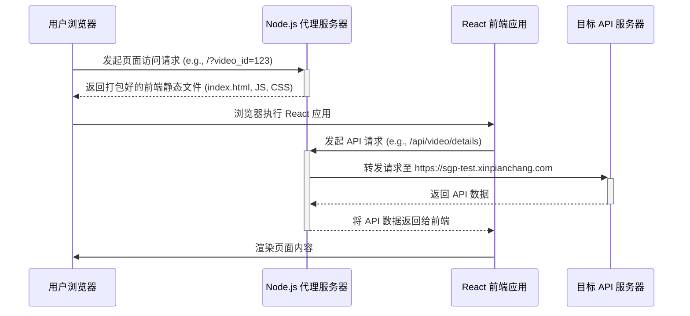

# H5 视频分享落地页全栈项目

这是一个完整的 H5 视频分享落地页解决方案，采用前后端分离架构。前端使用 React + Vite 构建，负责用户界面和交互；后端使用 Node.js + Express 搭建代理服务器，解决跨域问题并提供静态文件服务。

## 🏛️ 项目架构

项目的核心是解决前端应用在请求第三方 API 时遇到的跨域（CORS）问题。通过 Node.js 代理服务器作为中间层，将 API 请求转发到目标服务器，同时为前端单页应用（SPA）提供静态资源托管和路由支持。

### 请求流程图



## ✨ 核心功能

- **动态内容加载**：从 URL 中自动提取 `video_id`，异步请求视频数据并渲染页面。
- **跨域解决方案**：内置 Node.js 代理服务器，完美解决前端开发和部署中的跨域 API 请求问题。
- **响应式设计**：自动检测设备类型（移动端/桌面端），并加载相应的 UI 组件，提供最佳浏览体验。
- **丰富的页面路由**：
  - `/`：加载页面，根据设备类型自动重定向。
  - `/mobile`：移动端视频分享页。
  - `/desktop`：桌面端视频分享页。
  - `/download`：应用下载引导页。
  - `/blank`：内容不存在或加载失败时的空白页。
- **优雅的错误处理**：当视频 ID 缺失、内容被删除或请求失败时，能友好地重定向到提示页面。
- **灵活的部署选项**：提供 Node.js、Nginx 和 Apache 三种反向代理部署方案。

## 🛠️ 技术栈

| 分类       | 技术                                   |
| :--------- | :------------------------------------- |
| **前端**   | `React`, `React Router`, `Vite`        |
| **后端**   | `Node.js`, `Express`                   |
| **代理**   | `http-proxy-middleware`                |
| **代码规范** | `ESLint`                               |

## 📁 项目结构

```
. h5_link_project/
├── h5_link/                   # React 前端应用目录
│   ├── src/                   # 源代码
│   │   ├── components/        # React 组件 (移动端/桌面端/下载页等)
│   │   ├── api.js             # API 请求封装
│   │   └── App.jsx            # 主应用组件与路由逻辑
│   ├── vite.config.js       # Vite 构建配置
│   └── package.json         # 前端依赖
├── dist/                      # 前端应用打包后的静态文件目录
├── proxy-server.js            # Node.js 代理服务器
├── nginx-proxy-config.conf    # Nginx 代理配置示例
├── apache-proxy-config.conf   # Apache 代理配置示例
└── package.json               # 服务器依赖
```

## � 快速开始 (本地开发)

请遵循以下步骤在本地运行此项目。

### 1. 环境要求

- Node.js >= 16.0.0
- npm

### 2. 安装后端依赖

在项目根目录下，安装代理服务器所需的依赖。

```bash
npm install
```

### 3. 安装前端依赖

进入 `h5_link` 目录，安装前端应用所需的依赖。

```bash
cd h5_link
npm install
```

### 4. 构建前端应用

在 `h5_link` 目录下，将 React 应用打包成静态文件。文件将被输出到根目录的 `dist` 文件夹中。

```bash
npm run build
```

### 5. 启动代理服务器

返回到项目根目录，启动 Node.js 代理服务器。

```bash
cd ..
npm start
```

服务器启动后，您可以通过访问 `http://localhost:3000` 来查看应用。请确保在 URL 后面添加一个有效的 `video_id`，例如：`http://localhost:3000/?video_id=10904038`。

## 🚢 部署方案

本项目提供了三种生产环境部署方案。

### 方案一：使用 Node.js 服务器 (推荐)

这是最简单直接的部署方式。只需将整个项目（包括 `node_modules`）上传到服务器，然后通过 `npm start` 或进程守护工具（如 PM2）运行 `proxy-server.js` 即可。

```bash
# 在服务器上启动
npm start

# 或使用 PM2
pm2 start proxy-server.js --name h5-link-proxy
```

### 方案二：使用 Nginx 反向代理

如果您的服务器上已经运行了 Nginx，可以使用它来同时处理静态文件和 API 代理。

1.  将 `dist` 目录下的所有文件上传到服务器的网站根目录（例如 `/var/www/h5-link`）。
2.  使用 `nginx-proxy-config.conf` 中的配置。它会：
    -   托管静态文件。
    -   将 `/api` 请求代理到目标 API 服务器。
    -   处理 SPA 的 history 路由模式。

### 方案三：使用 Apache 反向代理

与 Nginx 类似，如果您使用 Apache，可以参考 `apache-proxy-config.conf` 文件进行配置，以实现相同的功能。

## 🧠 核心业务逻辑详解

1.  **入口 (`App.jsx`)**：应用加载时，`useEffect` 钩子会立即执行。
2.  **参数提取**：从 URL `location.search` 中解析出 `video_id`。
3.  **数据请求 (`api.js`)**：调用 `fetchVideoData` 函数，该函数会向 `/api/v2/video/details` 等路径发起请求。这些请求被代理服务器拦截并转发。
4.  **设备判断**：通过 `window.innerWidth` 判断用户设备是移动端还是桌面端。
5.  **路由重定向**：使用 `react-router-dom` 的 `navigate` 函数，根据设备类型将用户重定向到 `/mobile` 或 `/desktop`，并通过 `state` 将获取到的视频数据传递给目标页面组件。
6.  **页面渲染**：`VideoSharePage` 或 `VideoSharePage_Desktop` 组件接收到数据后，完成最终的页面渲染。


## 你好